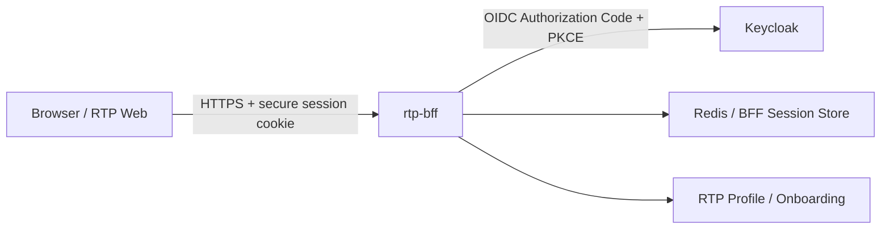
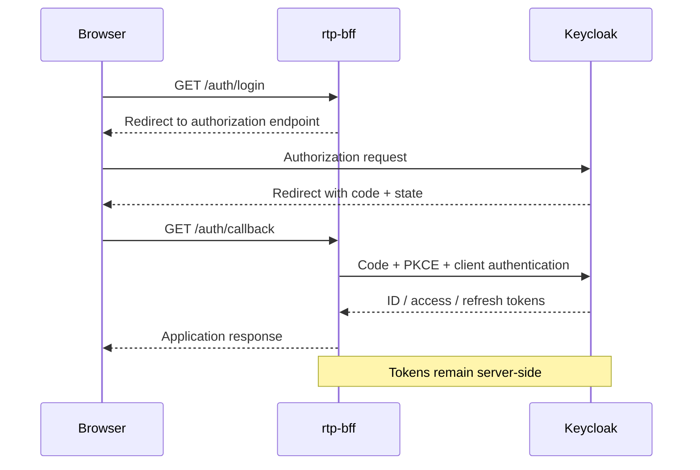

# RTP Backend for Frontend (BFF) Architecture

## Purpose

`rtp-bff` is the Backend-for-Frontend for the Rock the Prototype web
experience and the RTP Circle onboarding process.

Its primary architectural purpose is to establish a server-side trust
boundary between the user's browser and security-sensitive backend
capabilities such as authentication, session management, identity
integration and onboarding services.

The browser must not become the security boundary for OAuth/OIDC tokens,
client credentials or other server-side secrets.

## Current implemented slice

The first implementation establishes the HTTP application boundary and
provides a minimal liveness endpoint:

    GET /health -> 204 No Content

Unknown routes return:

    404 Not Found

The current service binds locally to:

    127.0.0.1:3000

This is a development-time binding only and is not a statement about the
production network topology.

## Target logical architecture
Initially:

Then:

## Current implemented slice

The current `rtp-bff` implementation provides:

- `GET /health`
- `GET /auth/login`
- `GET /auth/callback`

The authentication flow currently implements:

- OpenID Connect Authorization Code Flow
- PKCE S256
- OIDC `state`
- OIDC nonce validation
- server-side `AuthorizationTransaction` state
- browser-bound authorization transactions
- per-transaction short-lived HttpOnly pre-authentication cookies
- one-time and atomic authorization transaction consumption
- independent concurrent login transactions
- bounded pending-transaction storage
- login rate limiting
- trusted-proxy-aware client IP extraction
- bounded outbound OIDC HTTP timeouts
- cached provider metadata / JWKS
- exactly one metadata/JWKS refresh after `NoMatchingKey`
- server-side authorization-code exchange
- ID-token signature, issuer, audience, nonce and temporal validation
- authenticated BFF session creation after successful token validation
- opaque browser session identifier
- server-side access/refresh-token association
- Redis-backed production session-store adapter
- `HttpOnly` authenticated session cookie; production profile uses `Secure`,
  `SameSite=Strict`, `Path=/`, no `Domain`, and `__Host-Http-` prefix

### OIDC runtime configuration

OIDC runtime configuration is read from:

- `RTP_OIDC_CLIENT_SECRET` — required and MUST be non-empty.
- `RTP_OIDC_REDIRECT_URI` — optional; defaults to
  `http://127.0.0.1:3000/auth/callback` for local development.
- `RTP_TRUSTED_PROXY_CIDRS` — optional; comma-separated CIDR list of
  explicitly trusted reverse proxies.
- `RTP_REDIS_URL` — required in non-test runtime; connection URL for the
  dedicated BFF Redis session store. This value can contain credentials and
  MUST NOT be logged.
- `RTP_BFF_SESSION_TTL_SECONDS` — required in non-test runtime; positive
  bounded lifetime for authenticated BFF sessions.

The BFF validates this configuration when constructing the router.
A missing client secret, an invalid redirect URI, or an invalid trusted-proxy
CIDR prevents startup.

Forwarded client-address headers are trusted only when the immediate network
peer belongs to an explicitly configured trusted-proxy CIDR. Without such a
configuration, the socket peer address is authoritative.

### Authorization transaction storage

The currently implemented authorization-transaction store is process-local.

Therefore, the current deployment slice MUST run exactly one `rtp-bff`
application replica. An authorization request and its callback MUST be handled
by the same BFF process.

A BFF process restart intentionally invalidates all pending authorization
transactions. A browser whose transaction was pending during a restart MUST
start a new login through `/auth/login`.

Horizontal scaling MUST NOT be enabled while authorization transactions are
stored process-locally.

Before multiple BFF replicas are permitted, the process-local store MUST be
replaced by shared transaction storage that provides:

- atomic bound lookup-and-take semantics;
- one-time consumption under concurrent callbacks;
- TTL enforcement equivalent to the configured authorization transaction TTL;
- consistent visibility across all BFF replicas.

This restriction applies to authorization transactions only. OAuth access
tokens, refresh tokens and the OIDC client secret remain server-side and MUST
NOT be exposed to the browser.

The current implementation now establishes the first authenticated RTP BFF
session slice after successful OIDC token validation. OAuth access/refresh
tokens remain server-side and are associated with an opaque browser session
identifier. Production session state is stored in a dedicated Redis store.

The check-session API, token-refresh lifecycle, resource-server proxy, CSRF
protection for authenticated API calls, and logout remain future slices.

| ID | Requirement | Scenario | Expected observation |
|---|---|---|---|
| AC-OIDC-TXN-001 | REQ-OIDC-TXN-001 | Start two login transactions | `state`, nonce, PKCE verifier, and browser binding differ |
| AC-OIDC-TXN-002 | REQ-OIDC-TXN-002 | Correct browser presents callback | Callback proceeds |
| AC-OIDC-TXN-003 | REQ-OIDC-TXN-002 / REQ-OIDC-TXN-003 | Callback contains no pre-auth cookie | Callback rejected; no token exchange |
| AC-OIDC-TXN-004 | REQ-OIDC-TXN-002 / REQ-OIDC-TXN-009 | Browser B presents Browser A's callback | Callback rejected; transaction remains pending |
| AC-OIDC-TXN-005 | REQ-OIDC-TXN-005 | Successful callback is replayed | Replay rejected |
| AC-OIDC-TXN-006 | REQ-OIDC-TXN-006 | Two callbacks race for the same transaction | At most one reaches token exchange |
| AC-OIDC-TXN-007 | REQ-OIDC-TXN-007 | Callback uses expired transaction | Callback rejected; no token exchange |
| AC-OIDC-TXN-008 | REQ-OIDC-TXN-008 | `access_denied` with correct binding | HTTP error returned and transaction removed |
| AC-OIDC-TXN-009 | REQ-OIDC-TXN-009 | Wrong binding supplied | Transaction is not consumed |
| AC-OIDC-TXN-010 | REQ-OIDC-TXN-010 | Incorrect PKCE verifier | Token exchange fails |
| AC-OIDC-TXN-011 | REQ-OIDC-TXN-011 | ID Token contains wrong nonce | Token rejected |
| AC-OIDC-TXN-012 | REQ-OIDC-TXN-012 | ID Token signature invalid | Token rejected |
| AC-OIDC-TXN-013 | REQ-OIDC-TXN-012 | Signing key is initially unknown | Metadata/JWKS refreshed exactly once |
| AC-OIDC-TXN-014 | REQ-OIDC-TXN-012 | Rotated key exists after refresh | Token accepted after second verification |
| AC-OIDC-TXN-015 | REQ-OIDC-TXN-012 | Key still unknown after refresh | Token rejected; no further refresh |
| AC-OIDC-TXN-016 | REQ-OIDC-TXN-005 | Transaction already consumed | Callback rejected |
| AC-OIDC-TXN-017 | REQ-OIDC-TXN-003 | Successful authentication completes | Pre-authentication cookie invalidated |
| AC-OIDC-TXN-018 | REQ-OIDC-TXN-002 | Browser A starts login; Browser B presents code/state | Browser B cannot complete transaction |
| AC-OIDC-TXN-019 | REQ-OIDC-TXN-013 | Inspect browser-visible response | No OAuth access token, refresh token, or client secret present |

Not implemented in the current slice:

- check-session endpoint
- token refresh lifecycle
- resource-server proxy
- proxy destination allowlist
- logout