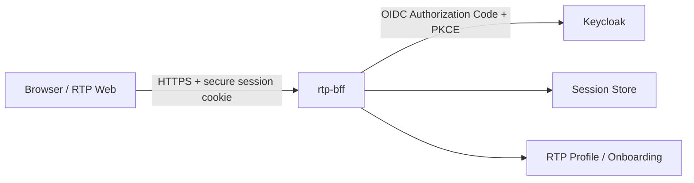
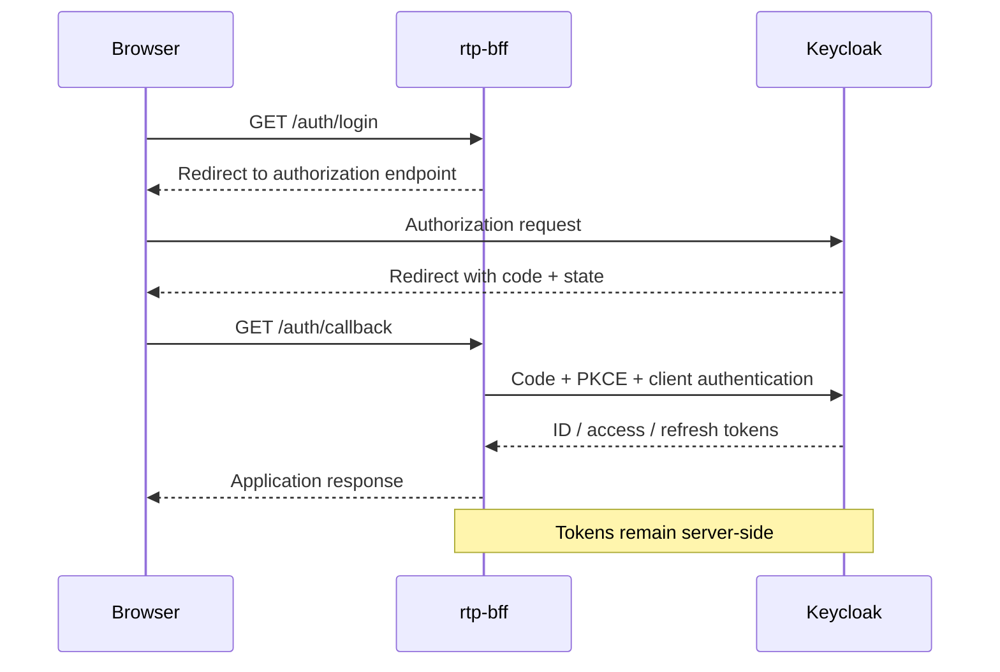

# RTP Backend for Frontend (BFF) Architecture

## Purpose

`rtp-bff` is the Backend-for-Frontend for the Rock the Prototype web
experience and the RTP Circle onboarding process.

Its primary architectural purpose is to establish a server-side trust
boundary between the user's browser and security-sensitive backend
capabilities such as authentication, session management, identity
integration and onboarding services.

The browser must not become the security boundary for OAuth/OIDC tokens,
client credentials or other server-side secrets.

## Current implemented slice

The first implementation establishes the HTTP application boundary and
provides a minimal liveness endpoint:

    GET /health -> 204 No Content

Unknown routes return:

    404 Not Found

The current service binds locally to:

    127.0.0.1:3000

This is a development-time binding only and is not a statement about the
production network topology.

## Target logical architecture
Initially:

Then:

## Current implemented slice

The current `rtp-bff` implementation provides:

- `GET /health`
- `GET /auth/login`
- `GET /auth/callback`

The authentication flow currently implements:

- OpenID Connect Authorization Code Flow
- PKCE S256
- OIDC `state`
- OIDC nonce validation
- server-side `AuthorizationTransaction` state
- browser-bound authorization transactions
- per-transaction short-lived HttpOnly pre-authentication cookies
- one-time and atomic authorization transaction consumption
- independent concurrent login transactions
- bounded pending-transaction storage
- login rate limiting
- trusted-proxy-aware client IP extraction
- bounded outbound OIDC HTTP timeouts
- cached provider metadata / JWKS
- exactly one metadata/JWKS refresh after `NoMatchingKey`
- server-side authorization-code exchange
- ID-token signature, issuer, audience, nonce and temporal validation

Required OIDC runtime configuration is validated when the BFF router is
constructed. A missing client secret, invalid redirect URI, or invalid trusted
proxy CIDR therefore prevents a production instance from starting with an
unusable authentication configuration.

Forwarded client-address headers are trusted only when the immediate network
peer belongs to an explicitly configured trusted-proxy CIDR. Without such a
configuration the socket peer address is authoritative.

OAuth access tokens, refresh tokens and the OIDC client secret remain inside
the BFF trust boundary and are not exposed to the browser.

The current implementation does not yet establish the final authenticated RTP
browser session. Session creation, authenticated application cookies and
application authorization remain part of the target architecture.