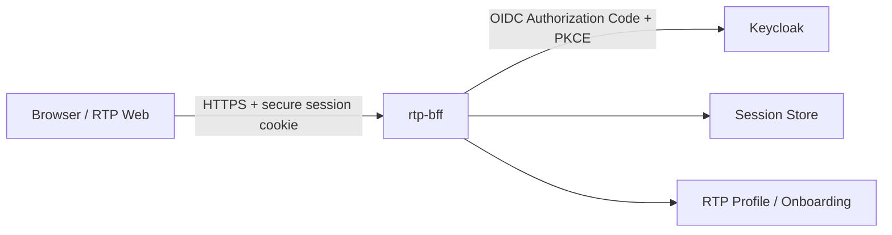
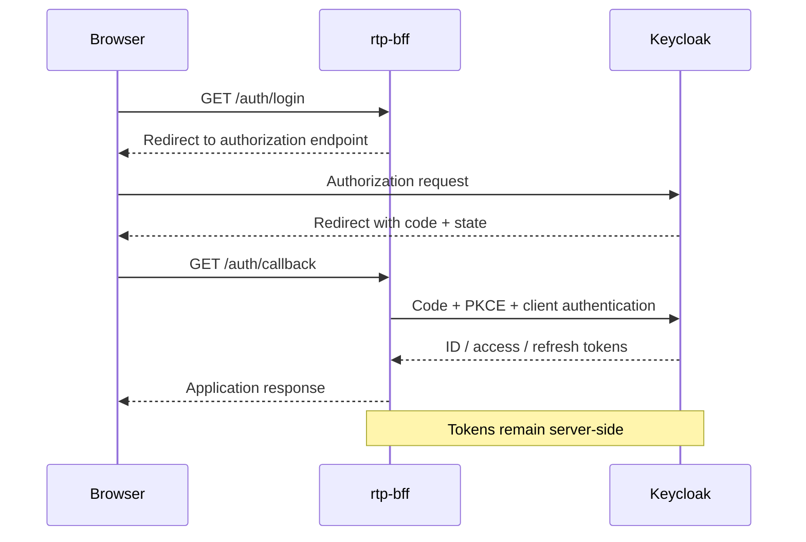

# RTP Backend for Frontend (BFF) Architecture

## Purpose

`rtp-bff` is the Backend-for-Frontend for the Rock the Prototype web
experience and the RTP Circle onboarding process.

Its primary architectural purpose is to establish a server-side trust
boundary between the user's browser and security-sensitive backend
capabilities such as authentication, session management, identity
integration and onboarding services.

The browser must not become the security boundary for OAuth/OIDC tokens,
client credentials or other server-side secrets.

## Current implemented slice

The first implementation establishes the HTTP application boundary and
provides a minimal liveness endpoint:

    GET /health -> 204 No Content

Unknown routes return:

    404 Not Found

The current service binds locally to:

    127.0.0.1:3000

This is a development-time binding only and is not a statement about the
production network topology.

## Target logical architecture
Initially:

Than:

